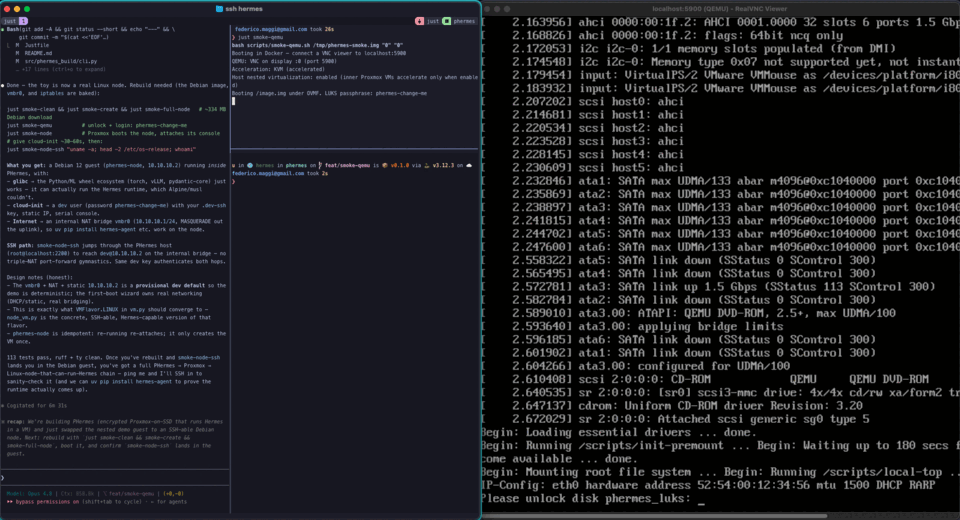

# PHermes

**Personal Hermes** — a fully encrypted, self-hosted, portable AI orchestration appliance.
Plug it into any KVM-capable machine. Boot. Open a browser. Your [Hermes Agent](https://github.com/NousResearch/hermes-agent) environment is ready. Still want to host it in the cloud? Import the disk volume into your favorite cloud provider's stack.



---

### After boot

```
 ____  _   _
|  _ \| | | | ___ _ __ _ __ ___   ___  ___
| |_) | |_| |/ _ \ '__| '_ ` _ \ / _ \/ __|
|  __/|  _  |  __/ |  | | | | | |  __/\__ \
|_|   |_| |_|\___|_|  |_| |_| |_|\___||___/

 ─────────────────────────────────────────────────────
 [ENCRYPTED]  [KVM-ISOLATED]  [SELF-HOSTED]  [PORTABLE]

   VM       macOS 15 Sequoia     ● running
   Hermes   gateway v0.4.1       ● ready
   Storage  LUKS2 / Btrfs / LVM  ● mounted
   Network  192.168.1.42         phermes.local

 → https://phermes.local
 ─────────────────────────────────────────────────────
```

### During build

```
 ╔══════════════════════════════════════════════════════════╗
 ║  phermes-build  ·  Secure AI appliance constructor      ║
 ╠══════════════════════════════════════════════════════════╣
 ║                                                          ║
 ║  ▸ Partitioning SSD ................................ done ║
 ║  ▸ Creating LUKS2 container ........ [████████░░] 80%   ║
 ║  ▸ Installing Proxmox VE .............. pending          ║
 ║  ▸ Configuring PHermes ................. pending          ║
 ║  ▸ Importing VM image .................. pending          ║
 ║                                                          ║
 ╚══════════════════════════════════════════════════════════╝
```

---

## What it is

PHermes packages Hermes Agent inside a QEMU/KVM virtual machine (macOS by default,
Windows and Linux also supported) running on a Proxmox VE host. The entire stack lives
on a single SSD. No cloud. No installation on the host. Unplug and take it anywhere.
Still want to host it in the cloud? Import the disk volume into your favorite cloud provider's stack.

**Boot chain:** `EFI → GRUB → Proxmox VE → QEMU/KVM VM → Hermes`

The Proxmox management interface is invisible to end users. PHermes replaces it with a
purpose-built web UI that exposes only what matters: VM console, Hermes dashboard, storage,
and system controls.

## Security

PHermes is designed for users who treat their AI environment as infrastructure worth protecting.

- **Full-disk encryption.** LUKS2 wraps everything except `/boot` and the EFI partition.
  Data at rest is unreadable without the passphrase. Theft of the drive means nothing.
- **VM isolation.** Hermes runs inside a VM, never on the host. The Proxmox host surface
  is minimal, hardened, and not exposed to the network.
- **Network lockdown.** Proxmox management (port 8006) is firewalled to localhost —
  reachable only via SSH tunnel. Samba is bound to the internal VM bridge, not the LAN.
- **No binaries distributed.** `phermes-build` fetches Proxmox from official community
  repos at build time. The tool itself is signed and checksummed. Nothing is bundled or
  pre-compiled by PHermes.
- **No shipped credentials.** A production build locks the root account (no console
  login) and refuses to use a hardcoded LUKS key — the passphrase is operator-supplied at
  build time. Proxmox admin happens only through the restricted PHermes UI / RBAC, never a
  default password. Known test credentials exist solely behind an explicit
  `--dev-credentials` flag and can never appear in a normal build.
- **No mandatory cloud.** LLM API calls are the only optional outbound traffic. Everything
  else runs entirely offline. Local model backends (llama.cpp, vLLM, Ollama) are supported.
- **Snapshot-before-change.** Every VM switch and every update triggers an automatic
  LVM-thin snapshot of the VM disk and a Btrfs snapshot of user data before touching
  anything. One command rolls everything back.

### Threat model

PHermes protects **data at rest** (LUKS2): a lost or stolen device is unreadable without
the passphrase. It deliberately does **not** protect **boot-chain integrity** — `/boot`
and the EFI partition are plaintext and unsigned, and the platform firmware is a trusted,
unverified root of trust. On a *portable* device that boots on arbitrary hardware, the host
firmware and an evil-maid attacker on the boot chain are largely out of scope to defend;
the LUKS passphrase and physical control carry the weight. A future *fixed-install* mode
(Secure Boot + signed UKI + TPM-sealed unlock) is the path to boot integrity for users who
trade portability for tamper-evidence.

Full STRIDE analysis — assets, trust boundaries, per-category threats, mitigations, and
residual risks: **[`docs/threat-model.md`](docs/threat-model.md)**.

## Personalisation

PHermes is not a fixed appliance. It adapts to how you work.

- **Guest OS.** Start with macOS (default), switch to Windows or Linux at any time.
  Your data follows you across switches via a shared Samba mount.
- **LLM backend.** Anthropic, OpenAI, AWS Bedrock, or any local model served via
  llama.cpp, vLLM, LiteLLM, or Ollama. Configured at first boot, changeable anytime.
- **Storage split.** Choose how much of the SSD goes to the persistent data partition
  vs. the exFAT drag-and-drop share. Default: 330 GB / 250 GB on a 1 TB drive.
- **VM specs.** RAM, disk size, and display configuration are set at build time and
  adjustable later via the PHermes UI.
- **Bring your own images.** Pre-stage a VM disk before running `phermes-build`,
  download at first boot, or use the `phermes-build --download-vm` pipeline.
  PHermes never distributes OS images.
- **Knowledge base grows with you.** Hermes profiles, tasks, memory, and documents
  live on the encrypted data partition and persist across guest OS switches, updates,
  and even full re-flashes of the system partition.

## Status

Building in public. **Phase 1 (the `phermes-build` CLI) is proven end-to-end** — the
boot chain works on emulated hardware, all the way up to a guest running an AI agent:

```
your machine
└─ QEMU (KVM, nested)
   └─ PHermes — LUKS2-encrypted SSD → GRUB → Proxmox VE host   ← built by phermes-build
      └─ Debian node VM (nested KVM, cloud-init)
         └─ Hermes Agent
            ● What hostname are you running into?
              → I'm running on hostname: phermes-node
            ● What OS flavor is it?
              → Debian GNU/Linux 12 (bookworm)
            ● Are you on real hardware?
              → No — a KVM virtual machine (vendor: QEMU)
```

What works today: SSD partitioning, LUKS2 full-disk encryption, LVM-thin + Btrfs, a
Proxmox VE host installed from upstream and booting under UEFI, encrypted-root unlock,
and a nested Linux guest (Debian, glibc) that runs the Hermes runtime — exercised by a
loop-device + QEMU smoke harness (`just smoke-*`) with serial console and dev SSH.

Not yet built: the first-boot wizard, the PHermes web UI, VM-flavor switching, and the
macOS/Windows guests (Phases 2–4). Credentials and networking in the build are provisional
dev defaults the wizard will own — production builds ship **no** known passwords/keys.

Design spec: [`docs/superpowers/specs/2026-05-31-phermes-design.md`](docs/superpowers/specs/2026-05-31-phermes-design.md)
Phase 1 plan: [`docs/superpowers/plans/2026-05-31-phase1-phermes-build.md`](docs/superpowers/plans/2026-05-31-phase1-phermes-build.md)

## Hardware requirements

**Target machine** (where PHermes runs):
- x86-64 with KVM support (Intel VT-x or AMD-V)
- RAM: ≥16 GB for macOS or Windows VM (32 GB recommended); ≥8 GB for console-only Linux
- ≥500 GB SSD (1 TB recommended; 2 TB+ for large knowledge bases)

**Builder machine** (where `phermes-build` runs):
- **Linux only** — `phermes-build` uses Linux kernel subsystems (cryptsetup, LVM, sfdisk, debootstrap) that have no equivalent on macOS or Windows
- macOS/Windows users: run via Docker (see below) or use a Linux VM

## Distribution

PHermes ships as `phermes-build` — a signed Python CLI that assembles a bootable SSD
from official upstream sources. No Proxmox, macOS, or Windows binaries are bundled.

### Native (Linux)

Requires Python 3.13+, uv, and the Linux toolchain (`cryptsetup`, `lvm2`, `btrfs-progs`,
`debootstrap`, `dosfstools`, `exfatprogs`):

```bash
# Minimal — first-boot wizard handles VM image acquisition
phermes-build /dev/sdX

# Disk setup only — skip Proxmox install (fast iteration / smoke testing)
phermes-build /dev/sdX --skip-os-install

# With a pre-staged macOS image
phermes-build /dev/sdX --import-vm macos=/path/to/macos.qcow2

# Download VM images at build time
phermes-build /dev/sdX --download-vm macos --download-vm windows

# Custom share partition
phermes-build /dev/sdX --share-size 500G --share-encrypted
```

### Via Docker (Linux host only)

Bundles the full toolchain — no local dependencies required beyond Docker:

```bash
# Pre-load the kernel targets the container can't modprobe itself
sudo modprobe dm-thin-pool dm-crypt btrfs vfat

sudo docker run --rm --privileged \
  -v /dev:/dev \
  ghcr.io/phretor/phermes-build \
  /dev/sdX
```

`-v /dev:/dev` shares the host device tree so the partition nodes created during the
build are visible inside the container. The container shares the host kernel but cannot
load modules itself, so the device-mapper and filesystem targets must be present on the
host first. `just docker-run /dev/sdX` wraps both steps.

> **Note:** Docker device sharing only works on Linux hosts. Docker Desktop on macOS
> and Windows does not surface host block devices into containers.

> **macOS note:** macOS VMs may only be run on Apple hardware under the macOS EULA.
> PHermes does not distribute macOS images; users supply their own installer.

## Development

[`just`](https://github.com/casey/just) drives every common task (`just --list` for the
full set). Unit tests need no root and run on any OS; everything else is Linux-only.

```bash
just install          # uv sync
just test             # unit tests (no root, any OS)
just check            # lint + typecheck + unit tests (pre-commit gate)
just docker-build     # build the phermes-build image
```

### Dependency updates

[Renovate](https://docs.renovatebot.com/) keeps `uv.lock`, `phermesd/Cargo.lock`, GitHub
Actions, and Dockerfile base images current. It runs self-hosted via
`.github/workflows/renovate.yml` (Mondays 04:00 UTC, or `workflow_dispatch`), configured by
`renovate.json`. New releases wait a 7-day cooldown before a PR is opened; Python dev tooling,
GitHub Actions, and lockfile maintenance automerge once CI is green, while Rust and runtime
updates open PRs for review.

The workflow needs a `RENOVATE_TOKEN` repository secret — a token with permission to open
branches and pull requests (a classic PAT with `repo` + `workflow` scope, or a fine-grained
token granting Contents, Pull requests, and Workflows write on this repo).

### Smoke testing on a virtual disk

The build runs end-to-end against a sparse file attached as a loop device — no real
hardware required. The recipes manage the loop device, kernel modules, and teardown:

```bash
just smoke-create     # 500G sparse image at /tmp/phermes-smoke.img + loop device
just smoke-run        # disk setup only (partition/LUKS/LVM/Btrfs), ~seconds
just smoke-full       # full build including Proxmox install
just smoke-inspect    # lsblk + LVM + Btrfs state
just smoke-verify     # mount every partition and assert expected content
just smoke-qemu       # boot the image in QEMU under OVMF (UEFI, no KVM needed)
just smoke-shell      # interactive shell in the build container
just smoke-clean      # tear down and delete the image
```

### Running a Linux node guest (nested)

`just smoke-full-node` bundles a Debian cloud image into the build (dev only — production
never ships an OS image). After booting the PHermes host, `phermes-node` has Proxmox start
it as a nested KVM guest, configured via cloud-init (a `dev` user with your `.dev-ssh` key,
a static IP on an internal NAT bridge). Then:

```bash
just smoke-node          # boot the node, attach its serial console
just smoke-node-ssh      # SSH in as dev@10.10.10.2 (jumps through the PHermes host)
```

glibc (Debian, not Alpine/musl) so the Python/ML wheel ecosystem works — i.e. it can
actually run the Hermes runtime. Requires host nested virt (`kvm_intel`/`kvm_amd
nested=1`), which `smoke-qemu` exposes via `-cpu host`.

`smoke-qemu` boots the built disk in QEMU through a small dedicated container
(`Dockerfile.qemu`) so no host QEMU/OVMF install is needed — it serves the display over
VNC on `localhost:5900`. Pass `native=1` to run QEMU directly on the host instead (opens
a graphical window when `$DISPLAY` is set), or `serial=1` to stream the boot to your
terminal (`just smoke-qemu serial=1`) — the guest is built with a serial console, so you
see the full boot log and can type the LUKS passphrase there. Exit serial mode with
`Ctrl-A X`.

It uses **KVM acceleration when `/dev/kvm` is available** and falls back to TCG emulation
automatically when it isn't — so KVM is never required, just used when present. If the
host has nested virtualization enabled (`kvm_intel`/`kvm_amd nested=1`) and `-cpu host`
exposes `vmx`/`svm`, the inner Proxmox VMs can accelerate too; otherwise only the PHermes
host itself is accelerated.

Unlike the build, `smoke-qemu` needs **no root**: QEMU runs as your user (native) or
unprivileged in the container (Docker), reading the image read-only via `-snapshot`. The
only privileged dependency is Docker-daemon access in Docker mode — and it skips `sudo`
when you're in the `docker` group.

`smoke-run` / `smoke-full` use Docker by default; pass `native=1` to run `phermes-build`
directly. The active loop device is recorded in `.smoke`. Always `smoke-clean` before a
fresh `smoke-create`. `smoke-verify` exits non-zero if any partition check fails, so it
doubles as a CI-style gate.

## License

PHermes's own code is licensed under the **GNU Affero General Public License v3.0**
(see [`LICENSE`](LICENSE)). Copyright © 2026 Federico Maggi.

**Commercial licensing.** As the copyright holder, the author can grant commercial licenses
for use without AGPL obligations — e.g. embedding PHermes in a proprietary hardware
appliance or hosted offering. Contact <fede@maggi.cc>.

Components fetched or used at build/run time keep their own licenses:

- Proxmox VE (fetched from official repos at build time): AGPL-3.0
- Hermes Agent: MIT
- Debian, the Linux kernel, and other packages: their respective licenses
